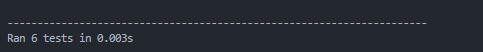

## Задание 

```
Разработать инструмент командной строки для учебного конфигурационного
языка, синтаксис которого приведен далее. Этот инструмент преобразует текст из
входного формата в выходной. Синтаксические ошибки выявляются с выдачей
сообщений.
Входной текст на учебном конфигурационном языке принимается из
файла, путь к которому задан ключом командной строки. Выходной текст на
языке toml попадает в стандартный вывод.
Однострочные комментарии:
! Это однострочный комментарий
Многострочные комментарии:
--[[
Это многострочный
комментарий
]]
Массивы:
( значение, значение, значение, ... )
Имена:
[a-zA-Z][a-zA-Z0-9]*
Значения:
129
• Числа.
• Массивы.
Объявление константы на этапе трансляции:
имя is значение
Вычисление константы на этапе трансляции:
.{имя}.
Результатом вычисления константного выражения является значение.
Все конструкции учебного конфигурационного языка (с учетом их
возможной вложенности) должны быть покрыты тестами. Необходимо показать 2
примера описания конфигураций из разных предметных областей.
```

## Транслироватние

> <<input>> конфиг для подключения к бд

```
! Настройки базы данных
host is localhost
port is 5432
credentials is (user, password)

```

> <<output>> формат .toml

```
PS C:\Users\SavvinPC\Documents\mirea\config_managment\translator> python config_lang_to_toml.py config_for_db.txt
host = "localhost"
port = 5432
credentials = [ "user", "password",]
```

> <<input>> конфиг для интерфейса

```
! Настройки интерфейса
theme is dark
resolution is (1920, 1080)
fonts is (Arial, Verdana, Courier)

```

> <<output>> формат .toml

```
PS C:\Users\SavvinPC\Documents\mirea\config_managment\translator> python config_lang_to_toml.py config_for_interface.txt
theme = "dark"
resolution = [ 1920, 1080,]
fonts = [ "Arial", "Verdana", "Courier",]
```
## Тесты

